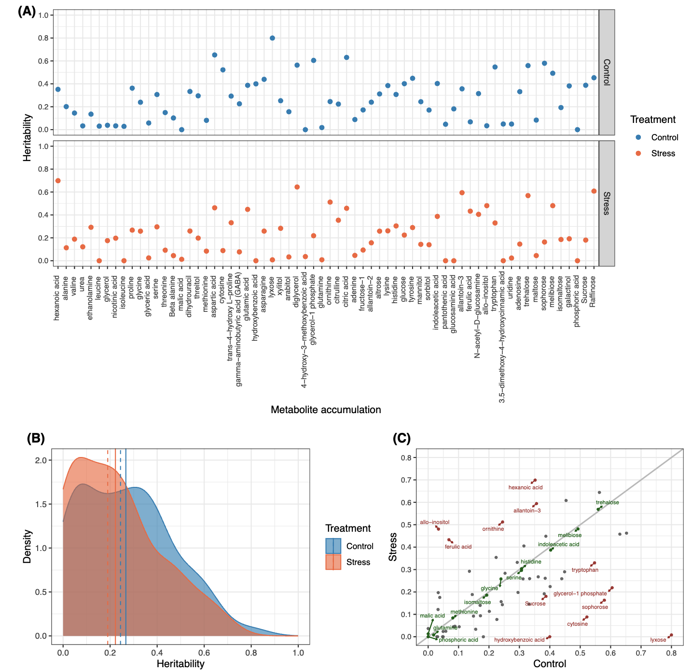

# Role of genomics on regulating rice grain metabolic variability under warmer nights: A statistical and image-based deep learning approach

Preprint: [link]()

## Abstract
It has been argued that metabolites can be used to accelerate crop improvement because metabolic profiles in crops are generally under genetic control. Evaluating the role of genetics in metabolic variation is a longstanding challenge. Rice, one of the world's most important staple crops, is known to be sensitive to recent increases in nighttime temperatures. Quantification of metabolic levels can help measure rice responses to high nighttime temperature (HNT) stress. However, the extent of metabolic variation that can be explained by regression on whole-genome molecular markers remains to be answered. In the current study, primary metabolites of a rice diversity panel generated from grains using gas chromatography-mass spectrometry were used. The metabolites obtained were low to moderately heritable, and the genomic prediction accuracies of the metabolites were within the expected upper limit set by their genomic heritability estimates. Genomic heritability estimates were slightly higher in the control group than in the HNT group. Genomic correlation estimates for the same metabolites between the control and HNT conditions indicated the presence of genotype by environment interactions. Reproducing kernel Hilbert spaces regression and deep learning, which treat markers as images, improved prediction accuracy, suggesting that some metabolites are under non-additive genetic control. Joint analysis of multiple metabolites simultaneously was effective in improving prediction accuracy by exploiting correlations among metabolites. The current study serves as an important first step in evaluating the cumulative effects of the genome in regulating metabolic variation under control and HNT conditions. 

## 0. Data Preprocessing
- [.Rmd file](https://github.com/yebigithub/GBLUP4Met/blob/main/PreProcessing/DataPreprocessing.Rmd) Including metabolite and genotype data cleaning
## 1. Genomic heritability of metabolites
- [.R file](https://github.com/yebigithub/GBLUP4Met/blob/main/heritability/h2_calculate.R) Using sommer package to calculate heritability for metabolites.
- [.Rmd file](https://github.com/yebigithub/GBLUP4Met/blob/main/heritability/h2_plot_drawing.Rmd) Drawing heritability plots.

  

Figure 2: Genomic heritability estimates of metabolite accumulation in control and high night temperature stress conditions. A) Scatter plot. B) Density plot. Solid and dashed lines indicate mean and median, respectively. C) Agreement of heritability estimates between control and high night temperature stress conditions. Metabolites in green and red colors indicate that the heritability difference between control and high night temperature stress conditions was small (< 0.05) and large (> 0.1)

## 2. Single-trait genomic prediction of metabolites
- [.R file](https://github.com/yebigithub/GBLUP4Met/blob/main/SingleTraitGBLUP/GBLUP_whole.R) Running Single trait GBLUP in cluster.
- [.Rmd file](https://github.com/yebigithub/GBLUP4Met/blob/main/SingleTraitGBLUP/SingleTraitGBLUP.Rmd) Drawing Single trait GBLUP plots.
- [.Rmd file](https://github.com/yebigithub/GBLUP4Met/blob/main/SingleTraitGBLUP/GK.Rmd) Selecting suitable bandwidth for RKHS.
- [.R file](https://github.com/yebigithub/GBLUP4Met/blob/main/SingleTraitGBLUP/GK.R) Runing Single trait RKHS in cluster.

  

Figure 4: Genomic prediction accuracy of metabolite accumulation in control and high night
temperature stress conditions. A) Box plot. The horizontal line indicates the mean value.
B) Density plot. The solid and dashed lines indicate the mean and median, respectively.
C) Agreement of genomic prediction accuracy between control and high night temperature
stress conditions. Metabolite accumulations in green and red colors indicate that the genomic
prediction difference between control and high night temperature stress conditions was small
(< 0.05) and large (> 0.1).

## 3. Genomic correlation between the same metabolite in different treatments
- [.R file](./GenoCorrSameMet/GenoCorrSameMet.R) Running multi-trait genomic correlation.
- [.Rmd file](./GenoCorrSameMet/GenoCorrSameMet.Rmd) Drawing multi-trait genomic correlation plots.

  

  
Figure 3: Genomic correlation estimates between the same metabolite accumulation measured under control and high night temperature stress conditions.  A) Scatter plot. B) Bar chart. Solid and dashed lines indicate mean and median, respectively.

## 4. Exporatory factor analysis
- [.Rmd file](./FactorAnalysis/FA4Met.Rmd) Factorial analysis to identify underlying latent factors controlling metabolites.
  

  

 

Figure S2: Heat maps of factor loading values after removing cross-loading by setting a cutoff value of lambda > |0.4|. The rows of each panel correspond to the observed metabolite accumulations and the columns correspond to five latent factors in control (A) and high night temperature stress conditions (B).

## 5. Simultaneous regression modeling of metabolites
- [.R file](./SimultaneousRegression/MegaLLM.R) Running MegaLMM for genomic prediction.
- [.R file](./SimultaneousRegression/MegaLLM_GK.R) Running MegaLMM for RKHS.
- [.Rmd file](./SimultaneousRegression/MegaLMM_drawing.Rmd) Drawing plots for MegaLMM.

  

 
Figure 8: Percentage difference of gain in prediction accuracy for multi-trait genomic best linear unbiased prediction (MegaLMM-G) and multi-trait reproducing kernel Hilbert spaces regression (MegaLMM-GK) relative to single-trait genomic best linear unbiased prediction (A). Density plots of percentage difference are shown for MegaLMM-G (B) and MegaLMM-GK (C).

## 6. Deep learning models
- [.Rmd file](./DL/DL_drawing.Rmd) Drawing barplot to compare performance of all deep learning models and RKHS.
  

  

 
Figure1: Flowchart of converting single nucleotide polymorphisms to image data

  

  

 
Figure 6: Example of a set of single nucleotide polymorphisms transformed into image data for a randomly selected genotype. Images of 12 chromosomes were processed in the multi-channel convolutional neural networks

  

  

 
Figure 5: Percentage difference of gain in prediction accuracy for single-trait reproducing kernel Hilbert spaces regression (RKHS), VGG16, ResNet50 EfficientNetB7, InceptionV3, MobileNetV2, and DenseNet201 relative to single-trait genomic best linear unbiased prediction.